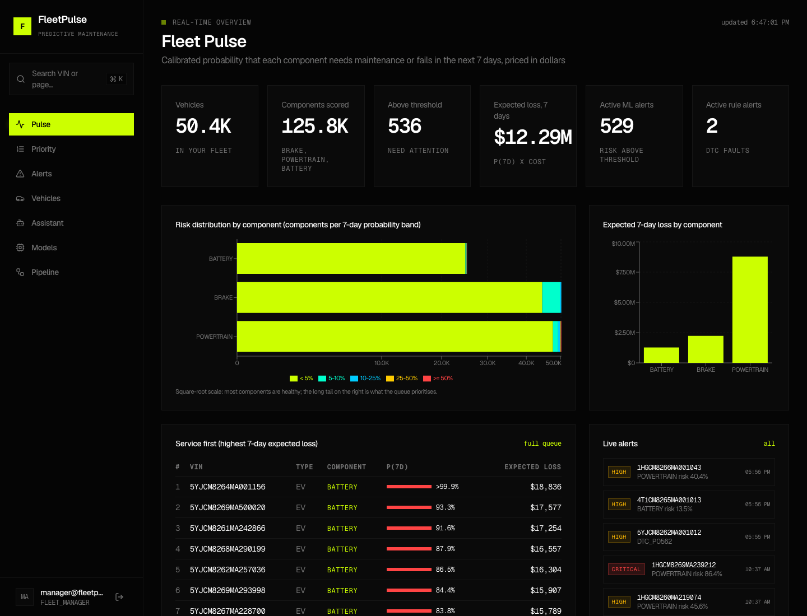

# FleetPulse: predictive maintenance for connected fleets

FleetPulse gives every vehicle component (BRAKE, POWERTRAIN, BATTERY) a **calibrated probability of
needing maintenance or failing in the next 7 days**, prices it in expected cost, and shows fleet
managers a ranked maintenance queue with alerts. It is built for the Connected Vehicle Intelligence
Hackathon (Motorq case study), on simulated telemetry from **100,000 vehicles**.



Other screens: [priority](docs/images/ui_priority.png), [vehicle](docs/images/ui_vehicle.png), [alerts](docs/images/ui_alerts.png), [assistant](docs/images/ui_assistant.png), [models](docs/images/ui_models.png), [pipeline](docs/images/ui_pipeline.png). The judge demo walkthrough is in [docs/demo-workflow.md](docs/demo-workflow.md).

## Results (measured; evidence in `docs/`)

| Area | Result |
|---|---|
| Fleet | 100,000 vehicles and 300,000 components seeded; 7.6M telemetry rows for the whole fleet (8h48m simulated); a 500-vehicle, 90-day cohort with ground truth (12.17M rows, 980 service records) for training |
| Model (test window, never used for fitting or selection) | PR-AUC POWERTRAIN 0.730 vs 0.034 prevalence (top-1 percent precision 0.96); BATTERY 0.330 vs 0.022; BRAKE 0.108 vs 0.032 (weak, reported as such) |
| Feature parity | Streaming vs offline: 803,279 values, 0 mismatches, max relative difference 1.9e-10, also with 15 percent duplicate replay and a crash mid-batch |
| Dedup | Live: 6,215 published, 5,199 distinct written, 1,016 duplicates dropped (the invariant holds) |
| Kafka (one laptop broker) | 65,848 records/s produced (1 KB), 41,417 records/s consumed by one consumer |
| Stream processor | 1,162 events/s per process with features (packed Redis state, 139 KB per vehicle) |
| Freshness | Ingest to calibrated risk in the database: p50 1.70 s, p95 1.73 s (event-driven scorer); dashboard refreshes every 2 s |
| Resilience | Kafka broker SIGKILLed mid-run: 0 duplicates, dedup invariant held, recovered without restarts |
| Multi-OEM | OEM-A and OEM-B (nested payload, US units) through the same pipeline; identical canonical events |
| AI assistant | Groq LLM tool-calling over read-only, tenant-scoped tools, with audit and a rules fallback |
| Security | JWT with roles and tenant isolation, audit of every data request, rate limiting, location minimisation, erasure; Semgrep 0, Bandit 0 open, pip-audit 0 known vulnerabilities |
| Tests | 95 automated tests (unit, integration on real Redis and Postgres, parity, leakage, API) plus scripted end-to-end checks (live smoke, parity, verify_phase2-4) |

Known gaps are stated in the Solution Document (sections 7 and 12):
- The end-to-end pipeline is not load-tested at 100K events/s.
- Terraform and Kubernetes are validated but not applied to a cloud.

## Architecture

```
Simulator -> [oem.inbound] -> Identity resolver (VIN check, DLQ) -> [vehicle.raw] -> Normalizer (OEM adapters)
  -> [vehicle.normalized] -> Stream processor: dedup (Bloom + Redis + atomic Lua) -> TimescaleDB -> exact 5m/1h/24h windows (Redis)
                          -> Rule engine: DTC rules -> PostgreSQL alerts + audit -> [vehicle.alerts]
Redis latest snapshots -> Risk scorer (calibrated models) -> PostgreSQL risk, ML alerts, priority read model
Browser -> Next.js dashboard (:3000, proxies /api/v1) -> FastAPI (JWT, RBAC, tenants, keyset pagination, rate limit, audit) -> PostgreSQL / TimescaleDB / Redis
```

Details:
- `docs/architecture.md`: C4 diagrams, latency per hop, storage map with CAP, lifecycle and cost.
- `docs/er-diagram.md`: the 3NF relational model.
- `docs/adr/`: five decision records.
- `docs/threat-model.md`: STRIDE.
- `docs/feature-spec.md`: every feature.
- `docs/algorithms-and-sql.md`: complexity and query plans.

## Quick start

```bash
cp .env.example .env                 # set JWT_SECRET and the three user passwords
python3 -m venv --system-site-packages .venv && .venv/bin/pip install -r requirements-dev.txt
bash scripts/bootstrap.sh            # stack, schema, users, 90-day cohort, features, dataset, models, scores
open http://localhost:3000           # dashboard; admin@ / manager@ / viewer@fleetpulse.local (passwords from .env)
```

- `docker compose up -d --build` alone starts the full stack. Data generation and training are in
  `scripts/bootstrap.sh`.
- `FLEET_100K=1 bash scripts/bootstrap.sh` also seeds and scores the 100K-vehicle fleet (about 1 h
  extra on a laptop).
- On an iCloud-synced folder, keep `.venv` and `data` outside the sync and symlink them in, so
  macOS does not evict their contents.

### Environment variables

| Variable | Meaning |
|---|---|
| `JWT_SECRET` | HS256 signing secret for API tokens (required) |
| `FP_ADMIN_PASSWORD`, `FP_MANAGER_PASSWORD`, `FP_VIEWER_PASSWORD` | Seeded user passwords |
| `RATE_LIMIT_PER_MINUTE` | Per-principal API limit (default 300) |
| `GROQ_API_KEY`, `GROQ_MODEL` | Optional: the fleet assistant's LLM (free tier at console.groq.com). Without a key the assistant uses its rules fallback |
| `FEATURES_ENABLED` | Stream-processor feature engine on or off (default true) |
| `POSTGRES_*`, `TIMESCALE_*`, `REDIS_*`, `KAFKA_BOOTSTRAP_SERVERS` | Store endpoints (compose sets them). From the host, the project Redis is on port 6380 (`REDIS_PORT=6380`) |

## Tests and verification

```bash
.venv/bin/python -m pytest tests -q --cov=fleetpulse_features --cov=simulator --cov=ml --cov=services/stream-processor/stream_processor --cov=services/api/app
.venv/bin/python scripts/verify_feature_parity.py --vehicles 20 --days 10
bash scripts/smoke_live.sh           # live Kafka smoke test: rows, dedup invariant, one alert
bash scripts/chaos_kafka.sh          # kill the Kafka broker mid-run: no duplicates, full recovery
bash scripts/verify_phase2.sh; bash scripts/verify_phase3.sh; bash scripts/verify_phase4.sh
.venv/bin/python scripts/load_api.py --concurrency 20 --seconds 60
```

CI (`.github/workflows/ci.yml`) runs the test suite with coverage, Semgrep, Bandit, pip-audit, the
image builds and a Trivy scan on every push.

## Repository layout

```
simulator/            fleet simulator: hidden degradation, ground truth, checkpoint/resume
services/             identity-resolver, normalization, stream-processor (dedup + features), rule-engine, api (+ legacy static dashboard at :8000)
frontend/             Next.js 16 dashboard (Pulse, Priority, Alerts, Vehicles, Assistant, Models, Pipeline)
fleetpulse_features/  shared statistics, feature formulas, labels, dataset assembly
ml/                   model wrapper, training, batch and live scoring
scripts/              generation, features, dataset, parity, verification, load tests, bootstrap
db/                   PostgreSQL and TimescaleDB schema and migrations
infra/                k8s (kustomize base + AWS/GCP overlays), terraform/aws
configs/ contracts/ docs/ tests/
```

## Deliberately not built

- A vector store (no decision needs similarity search).
- An end-to-end 100K events/s load test, burst injection, and pod-kill chaos (the Kafka broker
  kill and stream-processor restart tests exist).
- OIDC identity provider, device mTLS, DAST, BDD and contract suites.
- Grafana dashboards and distributed tracing (metrics are exposed in Prometheus format).
- Work orders, EWMA features, WebSockets.

## Declarations

All data is synthetic. Open-source components, licences and tools used are listed in the Solution
Document.
