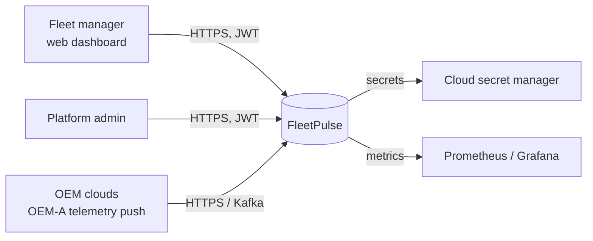
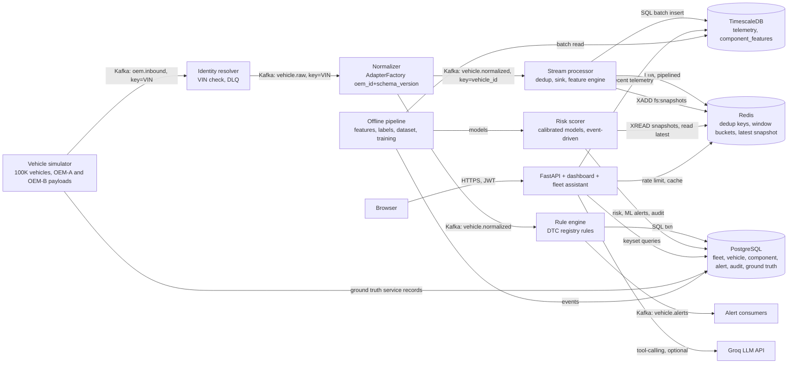

# FleetPulse Architecture

FleetPulse predicts, for every vehicle component (BRAKE, POWERTRAIN, BATTERY), the probability of a
maintenance or failure event in the next 7 days. It turns those predictions into a ranked
maintenance queue priced in expected cost.

## 1. System context (C4 level 1)

## 2. Containers (C4 level 2)

**Topic rules:**
- No service consumes and produces on the same topic.
- Partitioning is keyed by VIN or vehicle_id, so each vehicle's events stay ordered.

**Delivery:**
- Kafka is at-least-once.
- Every consumer is idempotent and commits offsets manually, after its effects succeed.

## 3. Path of one telemetry event

| Hop | Work | Expected latency |
|---|---|---|
| Simulator to `oem.inbound` | JSON envelope, key = VIN | < 10 ms |
| Identity resolver | VIN to vehicle_id lookup (Postgres, indexed) | 5-20 ms |
| Normalizer | Stateless OEM-A v1 to canonical mapping, schema validation | < 5 ms |
| Rule engine | DTC registry rule, one transaction for alert and audit row, publish | 20-100 ms (critical alert target < 5 s) |
| Stream processor | Dedup check, batch insert, one Lua script per event, snapshot step | batch of 500: 0.3-1 s |
| Risk scorer | Blocks on the snapshot stream, scores immediately; priority read model refreshed at most every 10 s | measured ingest to risk: p50 1.70 s, p95 1.73 s |
| Dashboard | Polls summary and alerts every 2 s | ingest to screen about 2-4 s |

## 4. Storage map (polyglot, with CAP choice)

| Data | Store | Why | CAP |
|---|---|---|---|
| Tenants, fleets, vehicles, components, drivers, alerts, audit log, users, risk, cost | PostgreSQL | ACID, foreign keys, 3NF, partial unique index for "one ACTIVE alert" | CP |
| Raw telemetry (time series), hourly feature snapshots | TimescaleDB | Hypertables partitioned by time, compression, time-window queries | CP per node; replicas for reads |
| Dedup keys, streaming window buckets, latest snapshot, rate-limit counters, summary cache | Redis | Sub-millisecond atomic updates (Lua), TTL expiry | AP for cache and counters. Dedup is authoritative per key: a lost key causes at most one duplicate write, absorbed by the sink's ON CONFLICT |
| Event log | Kafka | Durable, partitioned, replayable | AP with acks=all and ISR in production |
| Training datasets, feature archives | Parquet files (object storage in the cloud) | Columnar batch analytics, cheap cold storage | n/a |

A vector store is not used. None of the decisions depend on similarity search, and adding one
would be storage without a purpose.

## 5. Deployment view

- **Local:** `docker compose up` starts Kafka, Postgres, TimescaleDB, Redis, the four pipeline
  services, the API, the scorer and the simulator.
- **Cloud:** `infra/terraform/aws` creates the VPC (3 AZ), EKS, Multi-AZ RDS, MSK and ElastiCache.
  `infra/k8s` holds the Kubernetes manifests: a kustomize base plus AWS and GCP overlays.
- **Cloud-agnostic:** the images, manifests and code are identical across clouds. Only the
  ConfigMap endpoints in each overlay differ, and secrets arrive through External Secrets from the
  cloud's secret manager.
- **Scaling:**
  - Stateless services scale with HPA.
  - Stream consumers scale up to the partition count of `vehicle.normalized`.
  - Redis state is keyed per vehicle, so it shards across a Redis Cluster without code changes.

## 6. Data lifecycle (hot, warm, cold)

| Tier | Contents | Retention | Store |
|---|---|---|---|
| Hot | Window buckets, dedup keys, latest snapshots | 25 h of simulated time for buckets, 15 min for dedup | Redis |
| Warm | Raw telemetry, feature snapshots | 30 days uncompressed, then native compression | TimescaleDB |
| Cold | Telemetry older than 90 days, datasets, models | 2 years | Parquet on object storage (S3 / GCS) |

**Cost estimate at 100K vehicles and 1 event/s:**
- about 8.6 TB/day raw;
- with TimescaleDB compression of about 10x, about 0.9 TB/day warm;
- at object-storage prices of about USD 0.023 per GB-month, a year of cold Parquet (about 90 TB
  after compression and downsampling) costs about USD 2,000 per month.
