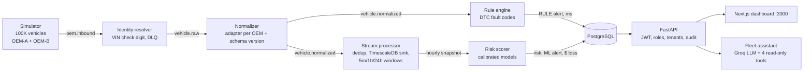

# FleetPulse: project workflow and judge demo

This document covers:
1. How the system works end to end.
2. The user story the demo tells.
3. A timed, click-by-click script for a 5-minute demo or video.
4. Answers to the questions judges usually ask.

Every number quoted here was measured; the evidence is in `docs/phase*-verification.md`.

---

## 1. Project workflow (what happens to one telemetry event)



| # | Stage | What it does | Why it matters |
|---|---|---|---|
| 1 | **Simulator** | 100,000 vehicles (ICE, EV, HYBRID) drive trips. Hidden component wear causes maintenance events and failures (the ground truth). Payloads come in two OEM formats: OEM-A is flat and metric, OEM-B is nested with US units. | Realistic, labelled data at hackathon scale. |
| 2 | **Identity resolver** | Validates the VIN check digit and maps VIN to vehicle_id. Bad messages go to `vehicle.dlq`. | Garbage never reaches analytics. |
| 3 | **Normalizer** | An `AdapterFactory` keyed by (oem_id, schema_version) converts every OEM into one canonical event. | A new OEM is one adapter class, not a pipeline change. |
| 4 | **Stream processor** | Dedup uses a Bloom filter, backed by Redis `SET NX` inside one atomic Lua script. Data goes into the TimescaleDB hypertable. Exact 5m/1h/24h window features are kept in Redis. Hourly feature snapshots are published to a Redis stream. | Kafka is at-least-once. Dedup makes the result exactly-once. |
| 5 | **Rule engine** | DTC fault codes raise RULE alerts within milliseconds, with at most one ACTIVE alert per (component, type). | Critical faults do not wait for ML. |
| 6 | **Risk scorer** | Event-driven: it blocks on the snapshot stream and scores immediately. Per component it produces a calibrated P(maintenance or failure within 7 days). Expected loss = P × (repair cost + downtime cost). It raises ML alerts above a per-component threshold and refreshes the priority read model at most every 10 s. | Turns telemetry into a dollar-ranked to-do list. Ingest to risk: p50 1.70 s. |
| 7 | **API** | FastAPI with JWT (HS256) and roles (ADMIN, FLEET_MANAGER, VIEWER). Tenant isolation follows vehicle → fleet → tenant. Also: keyset pagination, Redis rate limit, audit of every data request, location coarsening, driver erasure, Prometheus `/metrics`. | Secure multi-tenant API. p95 115.9 ms under load. |
| 8 | **Dashboard** | Next.js on :3000, proxying `/api/v1` to the API. Pages: Pulse, Priority, Alerts, Vehicles, Assistant, Models, Pipeline. Polls every 2 s; new alerts pop up as toasts. | What the fleet manager actually uses. |
| 9 | **Assistant** | Groq `openai/gpt-oss-120b` with tool calling. It can only call 4 read-only, tenant-scoped tools. Every question is audited. If the LLM is unavailable, a rules fallback answers. | Plain-English questions, no data leakage across tenants. |

**Offline (training) path:**
1. Run the 500-vehicle, 90-day cohort (12.17M rows).
2. Build features with the same code as streaming (parity: 803,279 values, 0 mismatches).
3. Label: event in the next 7 days.
4. Split chronologically (train / calibrate / threshold / test).
5. Train LR vs gradient boosting, apply Platt calibration, and pick the model on the threshold window.
6. Score once on the untouched test window.

---

## 2. User story

> **Persona:** Alex Rivera, maintenance operations manager for a 50,000-vehicle mixed fleet (vans,
> EVs, hybrids) at a logistics company. They manage a team of 12 technicians with fixed workshop
> capacity.
>
> **Today:** Alex learns about most failures when a driver calls from the roadside. Every
> unplanned breakdown costs a tow, an emergency repair and a day of lost deliveries. Scheduled
> maintenance is calendar based, so healthy vehicles get serviced while failing ones get missed.
>
> **User story:** *As a fleet maintenance manager, I want every brake, powertrain and battery
> ranked by the dollars I am likely to lose in the next 7 days, so that I can spend this week's
> limited workshop slots where they prevent the most expensive breakdowns.*

**Acceptance criteria, each shown live in the demo:**

| # | Alex needs to... | FleetPulse screen | Proof point |
|---|---|---|---|
| 1 | See fleet health at a glance | **Pulse** | Vehicles, components scored, number above threshold, 7-day expected loss in $ |
| 2 | Know what to fix first | **Priority** | Queue sorted by expected loss, filterable by component |
| 3 | Understand *why* a vehicle is flagged | **Vehicle detail** | Per-component probability vs threshold, telemetry trends, service history |
| 4 | Hear about critical faults immediately | **Alerts** + toast | A live DTC becomes a RULE alert in seconds; acknowledge it |
| 5 | Ask questions without learning a query tool | **Assistant** | "Which 3 vehicles should I service first for battery risk?" |
| 6 | Trust the predictions | **Models** | PR-AUC vs chance on a held-out, later time window |
| 7 | Keep other customers' data out | Viewer login | A different tenant sees different vehicles; direct URL gives 404; actions give 403 |
| 8 | Rely on it when infrastructure fails | **Pipeline** + chaos test | Broker killed for 39 s: 0 duplicates, recovered automatically |

**Business outcome:** the top of the queue is where the money is. For POWERTRAIN, 96% of the
top-1% flagged components really do need service within 7 days, against a 3.4% base rate
(21.5 times better than chance).

---

## 3. Before the demo (about 10 minutes, do it before judges arrive)

```bash
cp .env.example .env    # set JWT_SECRET, FP_ADMIN/MANAGER/VIEWER_PASSWORD, GROQ_API_KEY
bash scripts/bootstrap.sh    # whole stack + data + models; FLEET_100K=1 for the 100K fleet
docker compose up -d web     # dashboard on http://localhost:3000 (bootstrap already starts it)
```

**Checklist:**
- [ ] `docker compose ps` shows kafka, postgres, timescaledb, redis, identity-resolver, normalization, stream-processor, rule-engine, scorer, api and web all Up. The API is healthy.
- [ ] http://localhost:3000 shows the login page.
- [ ] Log in as the manager and check that Pulse shows about 50K vehicles and a non-zero expected loss.
- [ ] Assistant: ask one question. The footer should say `llm:openai/gpt-oss-120b`, not `rules`. If it says `rules`, check GROQ_API_KEY; the demo still works.
- [ ] Two terminals open with a large font, in the repo root.
- [ ] Browser zoom at 110-125%. Screen recorder at 1080p.
- [ ] Optional: open `docs/architecture.md` in a tab for the diagram.

**Accounts** (passwords from `.env`):

| Account | Role | Sees |
|---|---|---|
| `manager@fleetpulse.local` | FLEET_MANAGER | Tenant 1 (about 50K vehicles); can acknowledge alerts |
| `viewer@fleetpulse.local` | VIEWER | Tenant 2 only; read-only |
| `admin@fleetpulse.local` | ADMIN | All tenants (about 100K vehicles); audit log, exact locations |

---

## 4. Demo script (5 minutes)

| Time | Screen / action | Say |
|---|---|---|
| **0:00-0:25** | Title slide or login page | "Fleets find out about failures when a truck stops on the highway. Each breakdown costs a tow, an emergency repair and a lost day. FleetPulse predicts which component will need service in the next 7 days, prices the risk in dollars, and tells the manager what to fix first." |
| **0:25-1:00** | Log in as **manager**. **Pulse** page. | "This is Alex's fleet: 50,000 vehicles and 125,000 components scored live. 536 are above their risk threshold, and the expected loss over the next 7 days is $12.3M." Point to the risk distribution: "Most components are healthy; this long tail is what we act on." Point to expected loss by component. |
| **1:00-1:30** | **Priority**. Click the BATTERY filter, then ALL. | "The queue is sorted by expected dollar loss, not by raw probability. A 60% battery risk on an EV costs more than a 90% brake risk, so it ranks higher. Expected loss = probability × (repair cost + downtime)." |
| **1:30-2:00** | Click the top vehicle to open **Vehicle detail**. | "Here is why it is flagged. Powertrain risk is 95% against a 40% alert threshold, and its engine temperature runs hot. Battery shows n/a because this is a combustion van; we never score a component a vehicle does not have." |
| **2:00-2:45** | Terminal 1: `SMOKE_WALL_SECONDS=30 bash scripts/smoke_live.sh`. Switch back to the browser on **Alerts**. | "Now live data. 50 vehicles stream through Kafka in both OEM formats, with 20% deliberately duplicated messages and a critical brake fault injected." A toast pops up: "The fault became an alert within seconds." Click **Acknowledge**. When the script prints `published - distinct = duplicates dropped`, add: "Every duplicate was dropped and none was double counted." |
| **2:45-3:20** | **Assistant**. Click the suggestion or type *"Which 3 vehicles should I service first for battery risk, and why?"*, then *"Explain VIN 1HGCM8265MA298886"*. | "Alex can just ask. The LLM cannot touch the database. It can only call four read-only tools scoped to Alex's tenant." Point at the footer: "It shows which tool it called with which arguments, how long it took, and that the question was audited." |
| **3:20-3:45** | Log out, then log in as **viewer**. Paste the manager's vehicle URL. | "A different customer sees their own fleet. The manager's vehicle returns *not found*, and the viewer cannot acknowledge alerts. Tenant isolation is enforced in every SQL query, not in the UI." |
| **3:45-4:20** | **Models** | "Can you trust it? Failures are rare, so we report PR-AUC on a later time window the model never saw. Powertrain scores 0.73 against 0.034 by chance, which is 21 times better, and 96% of its top 1% are real. Brake is weak at 0.11, and we say so rather than hide it. Probabilities are calibrated, which is why the dollars add up." |
| **4:20-4:45** | **Pipeline** | "Under the hood: Kafka, an identity resolver with a dead-letter queue, OEM adapters, and dedup with a Bloom filter plus Redis in one atomic Lua script. We killed the Kafka broker for 39 seconds mid-stream: zero duplicates, and it recovered with no restarts." |
| **4:45-5:00** | Back to **Pulse** | "100,000 vehicles, calibrated risk in under 2 seconds from ingest, a dollar-ranked queue, a secure multi-tenant API, and it deploys to any cloud with the same containers, Terraform and Kubernetes. That is FleetPulse." |

**Backup plan:**
- **Smoke test is slow:** keep talking on the Alerts page. The pre-existing RULE alert (DTC_P0562) makes the same point.
- **Groq is down:** the assistant answers in `rules` mode, so say "this is the offline fallback".
- **Any page errors:** the API has its own static dashboard at http://localhost:8000 and Swagger at http://localhost:8000/docs.

**Optional extras if judges ask for more:**
- `bash scripts/chaos_kafka.sh`: kills the broker live and shows the invariant (takes about 2 min).
- Log in as **admin** to show the audit log: every request is recorded with user, tenant, path and status.
- ⌘K on any page: VIN search.

---

## 5. Judge Q&A cheat sheet

| Question | Answer | Evidence |
|---|---|---|
| Does it really handle 100K vehicles? | Yes. 100,758 vehicles and 300K components are seeded; 7.6M telemetry rows; 251K components scored. The admin view shows all of them. | README results, `docs/phase4-verification.md` |
| What throughput? | Kafka on one laptop broker: 65.8K events/s produced, 41.4K/s consumed. Stream processor with features: 1,162 events/s per Python process, scaling horizontally with partitions. 100K events/s end to end was **not** demonstrated on a laptop. | Solution Document section 7 |
| How fresh is the risk? | Ingest to risk in the database: p50 1.70 s, p95 1.73 s. The dashboard polls every 2 s. | Phase 4 verification section 8 |
| How do you avoid double counting? | Kafka is at-least-once. Each event's `(vehicle, seq)` is checked by a Bloom filter, then Redis `SET NX` inside the same Lua script that updates the feature windows, so the two are atomic. Invariant: published − distinct = dropped. | `smoke_live.sh`, `chaos_kafka.sh` |
| Is there data leakage in training? | Features use only data before the prediction time, enforced by a test that deletes or perturbs later data and checks nothing changes. Splits are chronological with 7-day buffers. The model is chosen on a threshold window, never on test. | `tests/test_leakage.py`, `docs/feature-spec.md` |
| Why PR-AUC and not accuracy? | Base rates are 2-3%. A model that always says "healthy" is 97% accurate and useless. | Models page |
| Why is brake weak? | In the simulator, brake wear shows mostly during rare harsh braking, so there is little signal. We report it honestly. | Models page footnote |
| New OEM? | Write one adapter class registered by (oem_id, schema_version). OEM-B (nested, US units) was added this way and produces identical canonical events. | `services/normalization/normalizer.py`, `tests/test_oem_b.py` |
| Security? | JWT, 3 roles, tenant isolation in SQL, Redis rate limit, audit log, location rounded to about 1 km for non-admins, driver erasure endpoint. Semgrep 0 findings, Bandit 0 open, pip-audit 0. | `docs/threat-model.md` |
| Can the LLM leak data or run SQL? | No. It only sees tool results, and the tools are read-only, parameterised and scoped to the caller's tenant. Prompts are audited; answers are grounded in tool output. | `services/api/app/assistant.py`, threat model |
| Cloud? | `docker compose` locally. Terraform for AWS (VPC, EKS, RDS Multi-AZ, MSK, ElastiCache). Kustomize base plus AWS and GCP overlays, including the web frontend. Validated, not applied, to avoid cloud cost. | `infra/` |
| What would you do next? | Batch the stream processor (Rust or vectorised) for 100K events/s, OIDC + mTLS, WebSockets instead of polling, and a pilot on real OEM data. | |

---

## 6. Troubleshooting

| Symptom | Fix |
|---|---|
| Login says invalid credentials | Run `.venv/bin/python scripts/seed_users.py` with `.env` exported. Emails end in `@fleetpulse.local`. |
| Pulse shows zeros | Run `.venv/bin/python ml/score.py batch`, and check that the `scorer` container is up. |
| Assistant footer says `rules` | GROQ_API_KEY is missing or invalid. Set it in `.env`, then run `docker compose up -d api`. |
| Port 3000 is busy | `lsof -ti tcp:3000 \| xargs kill`, then `docker compose up -d web` |
| Host tools cannot reach Redis | The project Redis is on host port **6380**: `export REDIS_PORT=6380` |
