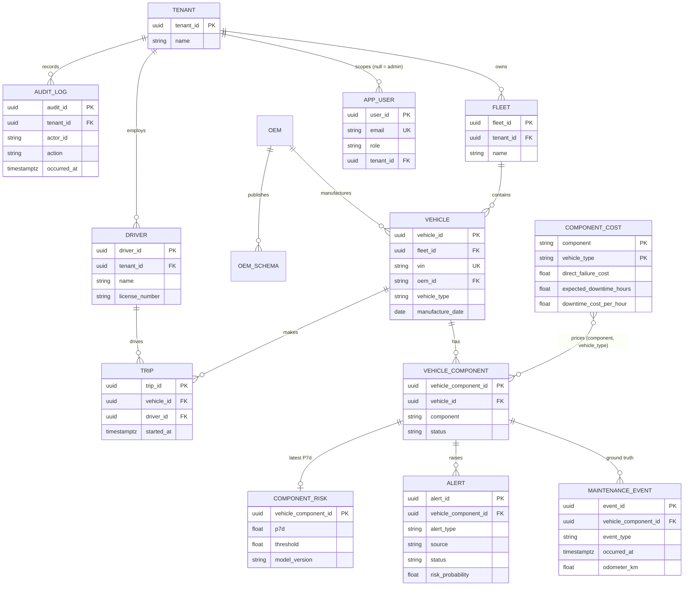

# Relational Model (PostgreSQL, 3NF)

## Normal form

Every non-key attribute depends only on its table's key.
- **Tenant ownership** is never copied onto child rows. It is derived through
  vehicle -> fleet -> tenant, which avoids update anomalies when a fleet changes tenant.
- **Cost profiles** are keyed by (component, vehicle_type) rather than stored per component row.
  That removes about 300K redundant copies at the 100K-vehicle scale.
- **Alert deduplication** is a partial unique index on (vehicle_component_id, alert_type) where
  status = 'ACTIVE'. It gives one active alert per component and type without a separate lock table.

## Deliberate denormalisation

`maintenance_priority_mv` is a materialized read model (CQRS). It joins component_risk,
vehicle_component, vehicle, fleet and component_cost, precomputes expected_loss, and carries sorted
indexes for keyset pagination.

The scorer refreshes it with `REFRESH MATERIALIZED VIEW CONCURRENTLY` after each scoring pass. Reads
never block, and the queue is at most one scoring interval stale. The write model stays normalised;
only this read path is denormalised, and the before/after query plans in
`docs/algorithms-and-sql.md` justify it.

## Time-series stores (TimescaleDB)

- **`telemetry`:** a hypertable partitioned by `event_ts` (7-day chunks), with an index on
  (vehicle_id, event_ts DESC) and a unique index on (vehicle_id, seq, event_ts) for idempotent
  writes. In a multi-node deployment, space partitioning on vehicle_id spreads writes and avoids
  hot spots. Each vehicle emits at most 1 event per second, so no single key dominates.
- **`component_features`:** a hypertable on `feature_ts`, with primary key
  (vehicle_id, component, feature_ts) for idempotent snapshot writes.
